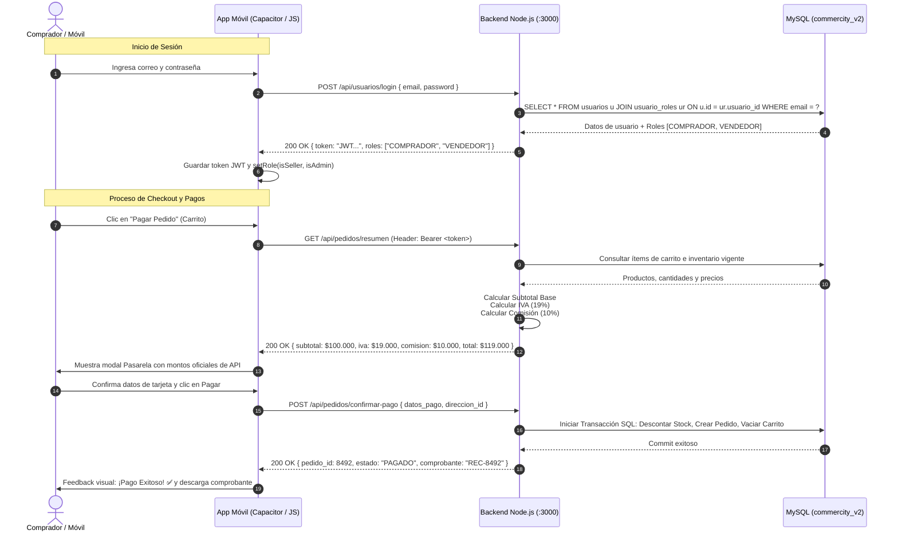

# ESPECIFICACIÓN DE REQUERIMIENTOS DE SOFTWARE (SRS) — SECCIÓN DE INTEGRACIÓN CON API BACKEND CENTRAL

**Proyecto:** CommerCity Mobile (v2.0)  
**Módulo:** Integración Arquitectural con API REST Central y Base de Datos MySQL  
**Destinatario:** Equipo de Desarrollo / Coordinación con Yepes (Cierre Sprint 2)  
**Fecha de Entrega:** Previo al cierre de Sprint (Entrega oficial: Martes)  
**Ambiente Backend:** `http://localhost:3000` (Node.js/Express)  
**Base de Datos Central:** MySQL `commercity_v2` en `149.130.178.228:3306`

---

## 1. Contexto y Objetivos de la Transición de Arquitectura

Actualmente, el cliente móvil de CommerCity opera bajo un esquema de persistencia local y emulación en cliente (`localStorage`, variables en memoria `PRODUCTS`, roles inferidos por texto de correo `email.includes("vendedor")`, credenciales de administrador en código `admin@gmail.com / admin123`, y cálculos fiscales/financieros locales).

El objetivo de este documento de especificación técnica es estandarizar la conexión entre el cliente móvil Capacitor y el backend central para la **Fase API (Sprint 2 - 3)**:
1. **Consumo de Backend Central:** Reemplazar el almacenamiento local por llamadas asíncronas vía `fetch` / `axios` al servidor central `http://localhost:3000`.
2. **Autenticación Real con JWT:** Implementar cabecera estándar `Authorization: Bearer <token>` y lectura de roles desde la base de datos relacional (`commercity_v2.usuario_roles`).
3. **Cálculo Financiero Lado Servidor:** Centralizar el cálculo de Subtotal, IVA (19%) y Comisión de Plataforma (10%) en el backend para evitar discrepancias fiscales o manipulaciones en cliente.
4. **Mapeo Integral de Pantallas/Modales:** Definir el contrato de entrada/salida (endpoints, verbos, parámetros, payload y renderizado UI) para cada una de las interfaces del aplicativo móvil.

---

## 2. Parámetros de Infraestructura y Base de Datos

| Parámetro | Valor Técnico | Observación Crítica |
| :--- | :--- | :--- |
| **API Base URL** | `http://localhost:3000` | **NO usar puerto 5000**. El backend corre en el puerto 3000. |
| **DBMS** | MySQL 8.0+ | Servidor centralizado de producción / staging |
| **Host BD** | `149.130.178.228` | Conexión directa gestionada exclusivamente por el backend |
| **Puerto BD** | `3306` | Puerto estándar MySQL |
| **Base de Datos** | `commercity_v2` | Esquema relacional centralizado |
| **Usuario BD** | `commercity_user` | Credenciales de servicio backend |
| **Formato Intercambio**| `application/json` | Encodificación UTF-8 en todas las peticiones |

---

## 3. Modelo de Autenticación y Control de Roles

### 3.1. Eliminación de Lógicas Mock Obsoletas
* **Deprecado:** `email.toLowerCase().includes('vendedor')` para determinar el rol de vendedor.
* **Deprecado:** Credenciales hardcodeadas `admin@gmail.com` / `admin123` en `handleLogin()`.
* **Deprecado:** Almacenamiento no seguro de roles en `localStorage.setItem('commercity_is_seller', ...)` sin firma criptográfica.

### 3.2. Mecanismo Real JWT (JSON Web Token)
1. **Handshake de Login:** El cliente envía credenciales vía `POST /api/usuarios/login`.
2. **Respuesta Backend:** Retorna un token JWT firmado (`accessToken`), tiempo de expiración (`expiresIn`) y la estructura de roles del usuario extraída de la tabla `usuario_roles`.
3. **Almacenamiento Seguro:** El token se almacena en el cliente (preferiblemente `Preferences` / `SecureStorage` de Capacitor o `localStorage` temporal bajo `commercity_auth_token`).
4. **Inyección en Peticiones:** Cada solicitud a endpoints protegidos debe incluir el header:
   ```http
   Authorization: Bearer <token_jwt>
   ```
5. **Estructura de la Tabla de Roles (`commercity_v2`):**
   * Tablas involucradas: `usuarios`, `roles`, `usuario_roles`.
   * Roles soportados:
     * `ID 1: COMPRADOR` (Rol base predeterminado para navegación y compras).
     * `ID 2: VENDEDOR` (Habilita panel de tienda, gestión de productos, inventario y retiros).
     * `ID 3: ADMINISTRADOR` (Habilita consola `/admin`, métricas, moderación de reportes y suspensión de usuarios).
6. **Políticas de Expiración e Interceptor:**
   * Al recibir código HTTP `401 Unauthorized` o `403 Forbidden`, la app borra la sesión local y redirige de inmediato a `page-login` disparando el toast informativo `"Sesión expirada. Inicia sesión nuevamente"`.

---

## 4. Política de Pagos y Cálculos Financieros del Servidor

En la fase previa, el frontend simulaba el cálculo en `openPasarela()` mediante:
```javascript
// Lógica legacy a eliminar:
const subtotal = Math.round(total / 1.19);
const iva = Math.round(subtotal * 0.19);
```

### 4.1. Reglas de Negocio Centralizadas en Servidor
1. **Cálculo de Precios e Impuestos:**
   * **Subtotal Gravable:** Determinado por el precio unitario neto y las cantidades validadas contra inventario real en base de datos.
   * **IVA (19%):** Calculado por el servidor conforme a la normativa tributaria colombiana sobre los productos gravados.
   * **Comisión CommerCity (10%):** Deducida automáticamente por el backend al procesar la liquidación del vendedor (Comisión de plataforma del 10% retenida al vendedor por cada transacción completada).
2. **Consistencia:** El cliente móvil **únicamente renderiza** los valores que calcula el endpoint `GET /api/pedidos/resumen` y confirma el endpoint `POST /api/pedidos/confirmar-pago`. Ningún total o impuesto se computa en el archivo `app.js`.

---

## 5. Matriz Completa de Mapeo: Pantallas / Modales vs Endpoints API

A continuación se detalla la matriz de correspondencia requerida para sincronizar los diagramas de casos de uso de Yepes con la arquitectura física de la app:

| ID Pantalla / Modal | Elemento DOM | Endpoint Backend | Verbo | Headers | Request Payload / Params | Datos Recibidos & Renderizado en UI |
| :--- | :--- | :--- | :--- | :--- | :--- | :--- |
| **Inicio de Sesión** | `page-login` | `/api/usuarios/login` | `POST` | `Content-Type: application/json` | `{ "email": "...", "password": "..." }` | Retorna `{ token, usuario: { id, nombre, email, roles: ["comprador", ...] } }` (roles en minúscula). Almacena JWT, asigna roles en UI y navega a `home` o `admin`. |
| **Registro de Usuario** | `page-registro` | `/api/usuarios/register` | `POST` | `Content-Type: application/json` | `{ "email": "...", "password": "...", "nombre_completo": "..." }` | Asigna rol base `comprador`. Retorna 201 o 400 si email duplicado. |
| **Cambio de Rol a Vendedor** | `page-perfil` / `page-tienda` | `/api/usuarios/me/rol` | `PATCH` | `Authorization: Bearer <token>` | `{ "rol": "vendedor" }` | Actualiza rol en BD a `vendedor` y habilita panel de comerciante. |
| **Recuperar Contraseña** | `page-recuperar` | `/api/usuarios/recover` | `POST` | `Content-Type: application/json` | `{ "email": "..." }` | Envía token de recuperación temporal (expira a los 5 minutos). |
| **Restablecer Contraseña** | `page-restablecer` | `/api/usuarios/reset-password` | `POST` | `Content-Type: application/json` | `{ "token": "...", "nuevaPassword": "..." }` | Actualiza la contraseña en BD (válido dentro de ventana de 5 min). |
| **Perfil de Usuario** | `page-perfil` | `/api/usuarios/me` | `GET` | `Authorization: Bearer <token>` | — | Retorna información del perfil del usuario autenticado vía JWT. |
| **Cuenta Bancaria Vendedor** | `page-tienda` / Ajustes | `/api/tienda/mi-cuenta-bancaria` | `GET` / `POST` / `PUT` | `Authorization: Bearer <token>` | Payload POST/PUT: `{ entidad, tipo_cuenta, numero_cuenta, titular }` | Gestiona datos bancarios de dispersión del vendedor. |
| **Cuenta Bancaria Enmascarada** | `page-tienda` / Ajustes | `/api/tienda/mi-cuenta-bancaria/masked` | `GET` | `Authorization: Bearer <token>` | — | Retorna número de cuenta enmascarado para visualización segura en UI. |
| **Catálogo Principal (Home)** | `page-home` | `/api/productos` | `GET` | — | Query: `?page=1&limit=20&nombre=...&categoria=...&vendedor=...` | Retorna `{ success: true, data: [...] }`. Alimenta el feed `#home-prod-grid` y filtros. |
| **Detalle de Producto** | Modal `#pd-modal` | `/api/productos/:id` | `GET` | — | Parámetro URL: `id` | Retorna detalle completo del producto envuelto en `{ success, data }`. |
| **Vista del Carrito** | `page-carrito` | `/api/carrito` | `GET` | — (Sin JWT) | Query: `?comprador_id=...` | Retorna ítems del carrito asociados a `comprador_id`. (Excepción de auth sin JWT). |
| **Agregar al Carrito** | Modal `#pd-modal` (Botón) | `/api/carrito` | `POST` | `Content-Type: application/json` (Sin JWT) | `{ "comprador_id": ..., "producto_id": ..., "cantidad": 1 }` | Responde 201 Created y sincroniza ítem en carrito. |
| **Modificar Cantidad Carrito** | `page-carrito` (`cartQty`) | `/api/carrito/:productoId` | `PATCH` | `Content-Type: application/json` (Sin JWT) | Query: `?comprador_id=...` <br/> Body: `{ "cantidad": nuevaCantidad }` | Modifica cantidad del producto para el `comprador_id`. |
| **Eliminar Ítem Carrito** | `page-carrito` (`cartRemove`) | `/api/carrito/:productoId` | `DELETE` | — (Sin JWT) | Query: `?comprador_id=...` | Elimina el producto del carrito para el `comprador_id`. |
| **Resumen de Checkout** | Modal `#pasarela-modal` (`openPasarela`) | `/api/pedidos/resumen` | `GET` | `Authorization: Bearer <token>` | — | Retorna cálculo fiscal oficial: subtotal, iva (19%), comisión (10%) y total. |
| **Confirmar Pago / Pedido** | Modal `#pasarela-modal` (`processPago`) | `/api/pedidos/confirmar-pago` | `POST` | `Authorization: Bearer <token>` | `{ "direccion_envio": "...", "metodo_pago": "tarjeta" \| "transferencia" \| "pse", "numero_tarjeta": "...", "nombre_tarjeta": "..." }` | Valida dirección (mín 5 caracteres), Luhn (RF118) si tarjeta. Responde 201 con `pedido_id`, `estado_pago: "Aprobado"`, `total_neto`, `iva`, `total`, `distribucion_90_10`. |
| **Historial de Compras** | `page-historial` | `/api/historial/compras` | `GET` | `Authorization: Bearer <token>` | Query: `?estado=todos` | Retorna compras del comprador con listado de líneas de detalle. |
| **Cancelar Compra / Detalle** | `page-historial` | `/api/historial/compras/:id/cancelar` | `POST` | `Authorization: Bearer <token>` | `:id` = línea del pedido (detalle) en estado `Pendiente` | Cancela la línea de compra y restituye inventario. |
| **Dashboard Vendedor Stats** | `page-tienda` | `/api/tienda/dashboard/stats` | `GET` | `Authorization: Bearer <token>` | — | Retorna estadísticas consolidadas del vendedor. |
| **Ventas de la Tienda** | `page-pedidos` / `page-tienda` | `/api/tienda/ventas` | `GET` | `Authorization: Bearer <token>` | — | Lista historial de ventas y pedidos recibidos. |
| **Ingresos del Vendedor** | `page-tienda` | `/api/tienda/ingresos` | `GET` | `Authorization: Bearer <token>` | — | Retorna desglose financiero de ingresos y liquidación neta. |
| **Validación de Tienda** | `page-tienda` | `/api/tienda/validacion` | `GET` | `Authorization: Bearer <token>` | — | Verifica estado de acreditación y validación del comerciante. |
| **Avanzar Estado de Envío** | Modal `#od-modal` | `/api/pedidos/:id/estado` | `PATCH` | `Authorization: Bearer <token>` | `{ "estado": "En camino" \| "Entregado" }` | Actualiza estado del envío por parte del vendedor. |
| **Publicar Producto** | Modal `#add-prod-modal` | `/api/productos` | `POST` | `Authorization: Bearer <token>` (Multipart) | FormData con datos del producto e imagen | Registra nuevo producto del vendedor. |
| **Editar Producto** | Modal `#edit-prod-modal` | `/api/productos/:id` | `PUT` | `Authorization: Bearer <token>` (Multipart) | FormData con campos actualizados | Modifica precio, stock o información de producto. |
| **Calificación de Vendedor** | Modal `#rating-modal` | `/api/calificaciones/vendedor` | `POST` | `Authorization: Bearer <token>` | `{ "pedido_id": ..., "vendedor_id": ..., "estrellas": 1..5, "comentario": "..." }` | Registra reseña (RF107, máximo 1 calificación por pedido). |
| **Bandeja de Notificaciones** | Panel `#notifs-panel` | `/api/notificaciones` | `GET` | `Authorization: Bearer <token>` | — | Retorna listado completo de notificaciones. |
| **Notificaciones No Leídas** | Header / Badge | `/api/notificaciones/no-leidas` | `GET` | `Authorization: Bearer <token>` | — | Retorna conteo/alertas pendientes de lectura. |
| **Marcar Todas Leídas** | Panel `#notifs-panel` | `/api/notificaciones/leidas` | `PATCH` | `Authorization: Bearer <token>` | — | Marca todas las notificaciones como leídas en BD. |
| **Marcar Notificación Leída** | Panel `#notifs-panel` | `/api/notificaciones/:id/leida` | `PATCH` | `Authorization: Bearer <token>` | — | Marca una notificación individual como leída. |
| **Conversaciones Chat** | `page-mensajes` | `/api/chat/conversaciones` | `GET` | `Authorization: Bearer <token>` | — | Lista conversaciones activas del usuario. |
| **Historial de Mensajes Chat** | `page-chat` | `/api/chat/mensajes/:usuarioId` | `GET` | `Authorization: Bearer <token>` | Parámetro URL: `usuarioId` | Carga historial de mensajes con el usuario indicado. |
| **Enviar Mensaje Chat** | `page-chat` | `/api/chat` | `POST` | `Authorization: Bearer <token>` (Multipart) | `FormData`: texto y archivo adjunto opcional | Envía mensaje con adjuntos multimedia opcionales. |
| **Marcar Mensaje Leído** | `page-chat` | `/api/chat/mensajes/:id/leido` | `PATCH` | `Authorization: Bearer <token>` | — | Marca mensaje individual como leído en BD. |
| **Centro de Reportes** | Modal `#report-modal` | `/api/reportes` | `POST` | `Authorization: Bearer <token>` (Multipart) | `FormData`: `{ tipo: "Producto" \| "Usuario", motivo, producto_id \| usuario_reportado_id }` + archivo opcional | Crea ticket de reporte con evidencia adjunta. |
| **Dashboard Admin Stats** | `page-admin` | `/api/admin/stats` | `GET` | `Authorization: Bearer <token>` (Rol admin) | — | Retorna estadísticas globales de plataforma. |
| **Gestión Admin Usuarios** | `page-admin` | `/api/admin/usuarios` | `GET` / `PATCH` | `Authorization: Bearer <token>` (Rol admin) | Sub-rutas bajo `/api/admin/*` | Administra estado y moderación de usuarios. |
| **Gestión Admin Productos/Reportes** | `page-admin` | `/api/admin/productos`, `/api/admin/reportes` | `GET` / `PATCH` | `Authorization: Bearer <token>` (Rol admin) | Sub-rutas bajo `/api/admin/*` | Modera productos publicados y gestiona reportes. |

---

## 6. Diagrama de Flujo de Datos: Solicitud Autenticada con Cálculo Backend



---

## 7. Instrucciones de Implementación para el Cierre de Sprint

1. **Alineación con Yepes:**
   * Los identificadores de endpoints (`/api/productos`, `/api/carrito`, `/api/pedidos/resumen`, `/api/pedidos/confirmar-pago`, `/api/historial/compras`, `/api/notificaciones`) coinciden 1:1 con la especificación de casos de uso y los diagramas de secuencia del SRS general.
2. **Cliente HTTP Centralizado:**
   * En la fase de conexión posterior a la entrega del SRS, se implementará un wrapper `apiClient.js` en `www/` configurado con `baseURL: 'http://localhost:3000'` e inyección automática del interceptor para el encabezado `Authorization: Bearer <token>`.
3. **Validación de Roles:**
   * El switch de interfaz entre Comprador, Vendedor y Administrador dependerá del array de roles provisto por `commercity_v2.usuario_roles`, garantizando seguridad contra accesos no autorizados en vistas restringidas (`page-admin`, `page-tienda`).
